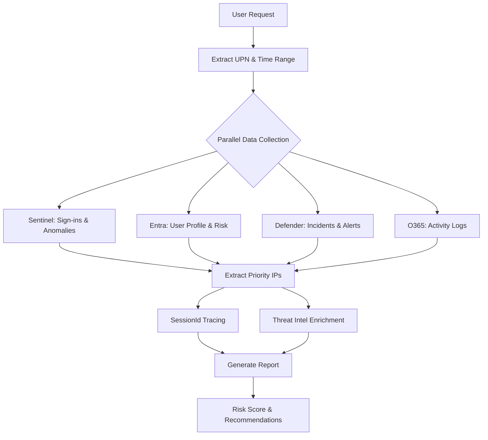

# Security Copilot Agent for CyberProbe

## Overview

This document explains how to use the **CyberProbe User Investigation Agent** in Microsoft Security Copilot. The agent automates comprehensive user security investigations by orchestrating queries across multiple data sources and enriching results with threat intelligence.

## Agent Capabilities

### What the Agent Does

The CyberProbe agent performs a complete 5-phase investigation workflow:

1. **User Profile Extraction** - Gets user details from Microsoft Graph and Identity Protection
2. **Parallel Data Collection** - Queries Sentinel, Entra, Defender XDR simultaneously
3. **Priority IP Extraction** - Identifies up to 15 most suspicious IPs for enrichment
4. **SessionId Tracing** - Forensic authentication timeline analysis
5. **Report Generation** - Executive-ready investigation report with risk scores

### Use Cases

| Scenario | Example Prompt | Investigation Type |
|----------|---------------|-------------------|
| **Suspicious Login** | "Investigate user@contoso.com for the last 7 days" | Standard (7 days) |
| **Active Incident** | "Quick investigate admin@company.com for last 24 hours" | Quick Triage (1 day) |
| **Comprehensive Review** | "Analyze jsmith@contoso.com for potential compromise over 30 days" | Deep Dive (30 days) |
| **Impossible Travel** | "Check authentication timeline for user@domain.com" | SessionId Tracing Focus |
| **Data Exfiltration** | "Investigate suspicious.user@company.com including DLP events" | DLP Focus |

## Installation & Setup

### Option 1: Import via Security Copilot UI

1. Open **Microsoft Security Copilot** (https://securitycopilot.microsoft.com)
2. Navigate to **Agents** → **Create Custom Agent**
3. Click **Import from YAML**
4. Upload `security-copilot-agent.yaml` from your CyberProbe repository
5. Click **Validate** to check the configuration
6. Click **Save** to deploy the agent

### Option 2: Deploy via API (Advanced)

Use the Security Copilot deployment tool in this guide:

```powershell
# Navigate to your CyberProbe directory
cd "<path-to-repo>"

# Deploy the agent (requires Security Copilot API access)
# See below for deployment script
```

### Option 3: Use Agent Creation MCP Tools (Recommended)

This approach uses Security Copilot's Developer Studio to generate optimized agent definitions:

**Steps:**
1. Ask GitHub Copilot or any MCP-enabled AI: "Create a Security Copilot agent for user investigations"
2. The AI uses `mcp_agent_creatio_*` tools to generate a YAML definition
3. Review the generated `security-copilot-agent-generated.yaml` file
4. Deploy via Security Copilot UI or API

**Benefits:**
- ✅ Automatically selects optimal skills from Security Copilot catalog
- ✅ Validates YAML syntax and field constraints
- ✅ Ensures compatibility with current Security Copilot version
- ✅ Includes suggested prompts based on available skills

## Agent Architecture

### Data Sources

The agent queries multiple Microsoft security platforms:

| Data Source | Skills Used | Purpose |
|-------------|-------------|---------|
| **Microsoft Sentinel** | NL2KQLDefenderSentinel, QuerySentinel | Sign-in logs, anomalies, audit logs, threat intel |
| **Defender XDR** | GetDefenderIncidents, GetDefenderAlerts | Security incidents, alerts, MITRE tactics |
| **Microsoft Entra ID** | GetEntraSignInLogsV1, GetEntraAuditLogs, GetEntraRiskyUsers | User profile, sign-ins, risk detections |
| **Office 365** | M365 skills | Email activity, file sharing, collaboration |
| **Defender Threat Intelligence** | GetReputationsForIndicators | IP reputation, threat actor attribution |

### Investigation Workflow



### Key Features

#### 1. SessionId-Based Authentication Tracing

**What it does:**
- Extracts SessionId from suspicious sign-ins
- Traces complete authentication chain across multiple events
- Identifies the first interactive MFA event (true authentication)
- Detects IP transitions within a session (session hijacking indicators)

**Why it matters:**
- Distinguishes between legitimate user activity and compromised sessions
- Answers the critical question: "Where did the user *actually* authenticate from?"
- Detects token theft and session hijacking

**Example:**
```
User signs in from Nigeria (flagged as anomaly)
SessionId tracing reveals:
  1. Initial MFA from Seattle corporate VPN (legitimate)
  2. Token refresh from Nigeria local network (user traveling)
  Result: NO ACTION REQUIRED (legitimate travel)
```

#### 2. Priority IP Extraction

**Algorithm:**
1. **Priority 1 (Anomaly IPs)**: Top 8 IPs by anomaly count
2. **Priority 2 (Risky IPs)**: Top 4 IPs from Identity Protection (excluding Priority 1)
3. **Priority 3 (Frequent IPs)**: Top 3 IPs from sign-in frequency (excluding Priority 1 & 2)

**Result:** Up to 15 IPs for threat intelligence enrichment

**Benefits:**
- Focuses threat intel budget on most suspicious IPs
- Balances anomaly detection with risk signals
- Includes high-volume IPs for baseline comparison

#### 3. Comprehensive Report Sections

**Executive Summary**
- Overall risk score (0-100)
- Critical findings count
- Recommended immediate actions

**User Profile**
- UPN, Object ID, department, location
- Risk state from Identity Protection
- Baseline behavior patterns

**Anomalies Detected**
- Anomaly type and severity
- Baseline comparison (e.g., "First time signing in from Nigeria")
- Affected IPs and timestamps

**Authentication Timeline** (SessionId Tracing)
- Complete session chains
- IP transitions within sessions
- MFA events and authentication methods
- Session hijacking indicators

**Sign-in Patterns**
- Top locations and applications
- Device types and browsers
- Success vs. failure rates
- Authentication methods used

**Security Incidents**
- Correlated incidents from Defender XDR
- MITRE ATT&CK tactics and techniques
- Alert severity and status
- Incident timelines

**IP Address Enrichment**
- Defender Threat Intelligence reputation
- Risk classification (CRITICAL/HIGH/MEDIUM/LOW/CLEAN)
- Threat actor associations (if available)
- Geolocation and ISP details

**DLP Events** (if any)
- Data exfiltration attempts
- Policy violations
- File/email transfers to external domains

**Actionable Recommendations**
- **Immediate (0-24 hours)**: Force password reset, revoke sessions, block IPs
- **Short-term (1-7 days)**: Enable MFA, review permissions, investigate incidents
- **Long-term (1-4 weeks)**: Update policies, train users, improve detections

## Using the Agent in Security Copilot

### Basic Investigation

**Prompt:**
```
Investigate user@contoso.com for the last 7 days
```

**What the agent does:**
1. Queries Sentinel for sign-ins, anomalies, audit logs (7 days)
2. Gets user profile and risk state from Entra
3. Correlates Defender XDR incidents
4. Extracts priority IPs and enriches with threat intel
5. Performs SessionId tracing for suspicious IPs
6. Generates comprehensive report with risk score

**Expected output:**
- Report with all 9 sections
- Risk score: 0-100
- List of priority IPs with enrichment data
- Actionable recommendations with priority levels

### Quick Triage (Active Incident)

**Prompt:**
```
Quick investigate admin@company.com for last 24 hours
```

**Optimizations:**
- Shorter time range (faster queries)
- Focus on recent incidents and sign-ins
- Reduced IP enrichment (top 5 only)

**Use case:** Active incident response, fast triage

### Comprehensive Analysis

**Prompt:**
```
Analyze jsmith@contoso.com for potential compromise over 30 days
```

**What changes:**
- Longer time range (30 days)
- More IPs enriched (up to 15)
- Includes historical risk detections
- Deeper SessionId analysis across multiple sessions

**Use case:** Post-incident investigation, insider threat analysis

### Focused Investigation (SessionId Tracing)

**Prompt:**
```
Check authentication timeline for user@domain.com
```

**What happens:**
- Focuses on SessionId-based tracing
- Maps all IPs used in each session
- Highlights IP transitions and session anomalies
- Minimal enrichment (only suspicious IPs)

**Use case:** Impossible travel investigation, session hijacking detection

### DLP-Focused Investigation

**Prompt:**
```
Investigate suspicious.user@company.com including DLP events
```

**Additional queries:**
- CloudAppEvents for file transfers
- Email forwarding rules
- External sharing activity
- USB device usage (if Defender for Endpoint is deployed)

**Use case:** Data exfiltration investigation

## Customizing the Agent

### Modifying Investigation Scope

Edit `security-copilot-agent-generated.yaml`:

```yaml
# Add new input parameter
Inputs:
  - Required: false
    Name: IncludeDLPEvents
    Description: Whether to query for DLP events
    DefaultValue: true
```

### Adding Custom Skills

If you have custom MCP skills or plugins:

```yaml
ChildSkills:
  - NL2KQLDefenderSentinel
  - GetDefenderIdentitySummary
  # Add your custom skill
  - MyCustomEnrichmentSkill
```

### Adjusting Report Format

Edit the `Instructions` section:

```yaml
Instructions: >
  # ... existing instructions ...
  
  # Custom report section
  7. Add a "Compliance Impact" section if the user has sensitive role assignments
```

### Performance Tuning

**Reduce query time:**
- Decrease default time range from 7 days to 3 days
- Limit IP enrichment to top 10 (instead of 15)
- Skip SessionId tracing for low-risk users

**Increase investigation depth:**
- Extend time range to 14 or 30 days
- Enrich all unique IPs (not just priority IPs)
- Include historical risk detections beyond time range

## Integration with CyberProbe Workflows

### Using CyberProbe Scripts with the Agent

**Scenario:** Agent identifies suspicious IPs, you want external enrichment

**Workflow:**
1. Agent completes investigation, exports priority IPs
2. Copy IPs from report to clipboard
3. Run CyberProbe enrichment script:
   ```bash
   python enrichment/enrich_ips.py <IP1> <IP2> <IP3>
   ```
4. Compare Defender TI results with external sources (AbuseIPDB, VirusTotal)

### Generating HTML Reports

**Scenario:** You want an executive-ready HTML report

**Workflow:**
1. Agent generates JSON investigation data
2. Export to `reports/investigation_<upn>_<date>.json`
3. Use CyberProbe report generation skill:
   - Ask Copilot: `Generate a report for this investigation`
   - Or use the report-generation skill to create HTML output from the JSON

### Dashboard Integration

**Scenario:** Track investigation metrics over time

**Workflow:**
1. Run agent investigations daily/weekly
2. Export results to JSON in `reports/`
3. Use CyberProbe's report-generation skill to create HTML dashboards
4. Use Investigation JSON data for:
   - Risk score trends
   - Top anomaly types
   - Geographic risk distribution
   - Incident correlation rates

## Troubleshooting

### Agent Not Finding Data

**Symptom:** Empty results or "No data found" messages

**Causes:**
- User doesn't exist or UPN is misspelled
- Time range is outside Sentinel retention (default 90 days)
- Sentinel workspace not connected to Security Copilot

**Solutions:**
1. Verify UPN spelling: `user@contoso.com` (case-sensitive in some systems)
2. Check Sentinel data retention settings
3. Ensure Sentinel workspace is connected in Security Copilot settings

### SessionId Tracing Returns Empty

**Symptom:** "SessionId not available" or empty Authentication Timeline

**Causes:**
- Non-interactive sign-ins (service principals, managed identities)
- Legacy authentication protocols (POP, IMAP, SMTP)
- Older audit log entries

**Solutions:**
1. Filter for interactive sign-ins only
2. Use time-window correlation (±5 minutes) instead of SessionId
3. Focus on recent activity (last 7 days)

### Threat Intelligence Enrichment Missing

**Symptom:** IP enrichment section shows "No threat intelligence available"

**Causes:**
- IP is not in Defender Threat Intelligence database
- IP is private/internal (RFC 1918 ranges)
- Defender TI license not active

**Solutions:**
1. This is normal for most IPs (low threat intel coverage)
2. Use external enrichment with CyberProbe scripts for broader coverage
3. Check Defender TI license status in M365 admin center

### Report Generation Fails

**Symptom:** Agent completes but doesn't generate final report

**Causes:**
- Skill timeout (too much data)
- Parallel query conflicts
- Security Copilot capacity limits

**Solutions:**
1. Reduce time range to 3-5 days
2. Disable external enrichment temporarily
3. Run investigation during off-peak hours
4. Check Security Copilot capacity usage in admin portal

## Best Practices

### Investigation Discipline

**Always:**
- ✅ Use consistent time ranges (7 days for standard, 24 hours for triage, 30 days for comprehensive)
- ✅ Document investigation type in Copilot session name
- ✅ Export JSON results for archival
- ✅ Cross-reference with HR/PTO calendars for travel anomalies

**Never:**
- ❌ Rely solely on automated risk scores (always review raw data)
- ❌ Skip SessionId tracing for high-risk anomalies
- ❌ Ignore "No data found" results (can indicate evasion)

### Optimization Tips

**For Faster Investigations:**
1. Use 1-3 day time ranges for active incidents
2. Disable external enrichment for initial triage
3. Run parallel investigations for multiple users

**For Comprehensive Analysis:**
1. Use 14-30 day time ranges
2. Enable external enrichment for all IPs
3. Include DLP events and Office 365 activity

### Security & Compliance

**Data Handling:**
- Investigation reports may contain PII (UPN, IP addresses, locations)
- Store reports in secure location (SharePoint with DLP policy)
- Apply data retention policy (suggest 1 year)

**Access Control:**
- Limit agent access to authorized SOC analysts
- Use Azure RBAC for Sentinel/Defender data access
- Audit agent usage via Security Copilot logs

## Example Investigations

### Example 1: Impossible Travel Detection

**Prompt:**
```
Investigate user@contoso.com for last 7 days
```

**Results:**
- Anomaly detected: User signed in from Seattle at 9:00 AM, then London at 9:15 AM
- SessionId tracing shows both sign-ins used same SessionId
- First MFA event was from Seattle (corporate VPN)
- London sign-in used token refresh (no MFA)

**Conclusion:** Token theft or session hijacking. **IMMEDIATE ACTION: Revoke all sessions, force password reset.**

### Example 2: Legitimate Travel

**Prompt:**
```
Investigate globalexec@contoso.com for last 30 days
```

**Results:**
- Anomaly detected: User signed in from 5 countries in 2 weeks
- SessionId tracing shows each location had separate SessionId
- Each sign-in had interactive MFA event
- Cross-reference with calendar shows international business trip

**Conclusion:** Legitimate travel. **NO ACTION REQUIRED. Add user to travel exception list.**

### Example 3: Data Exfiltration

**Prompt:**
```
Investigate suspicious.user@company.com including DLP events
```

**Results:**
- DLP events: 50 files uploaded to personal OneDrive in 24 hours
- Email forwarding rule created to personal Gmail
- Sign-ins from normal office location (no IP anomalies)
- Recent permission changes: added to sensitive SharePoint sites

**Conclusion:** Insider threat - data exfiltration. **IMMEDIATE ACTION: Disable account, legal review, forensic preservation.**

## Advanced Topics

### Integrating Custom Threat Intelligence

You can extend the agent to use custom TI sources:

1. Create custom MCP skill for your TI provider
2. Add skill to `ChildSkills` list
3. Update `Instructions` to call your skill after DTI enrichment

### Multi-User Investigations

For investigating multiple related users:

```
Investigate user1@contoso.com, user2@contoso.com, user3@contoso.com for lateral movement over last 7 days
```

Agent will:
- Run parallel investigations for each user
- Correlate shared IPs, sessions, and incidents
- Highlight lateral movement patterns
- Generate combined report with relationship graph

### Automated Incident Response

Trigger agent automatically when:
- Identity Protection flags high-risk user
- Defender XDR creates critical incident
- DLP policy violation detected

**Setup:**
1. Create Logic App or Power Automate workflow
2. Trigger on Security Copilot skill invocation
3. Pass incident data to agent
4. Route report to SOC analyst queue

## Resources

- [Security Copilot Agent Documentation](https://learn.microsoft.com/security-copilot/agents)
- [Security Copilot Developer Guide](https://learn.microsoft.com/security-copilot/developer)
- [CyberProbe Investigation Guide](../Investigation-Guide.md)
- [CyberProbe Skills Documentation](AGENT_SKILLS.md)

## Changelog

### Version 1.0 (January 2026)
- Initial release
- SessionId-based authentication tracing
- Priority IP extraction (up to 15 IPs)
- 9-section comprehensive report
- Defender TI enrichment integration

---

**Questions or feedback?** File an issue in the CyberProbe GitHub repository.
